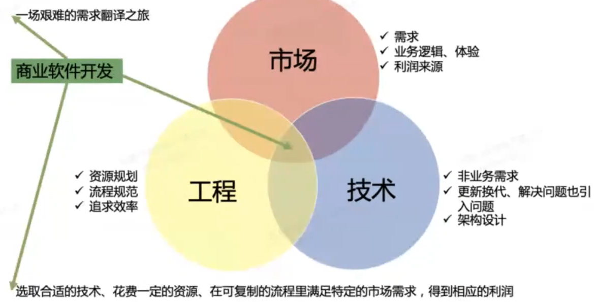
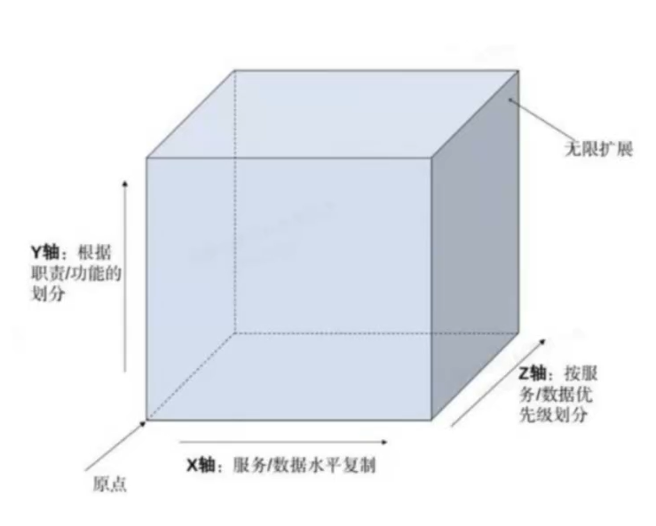
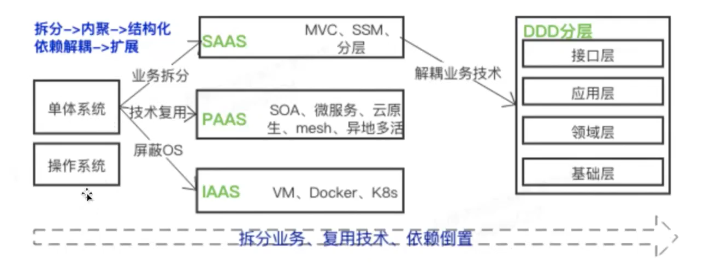
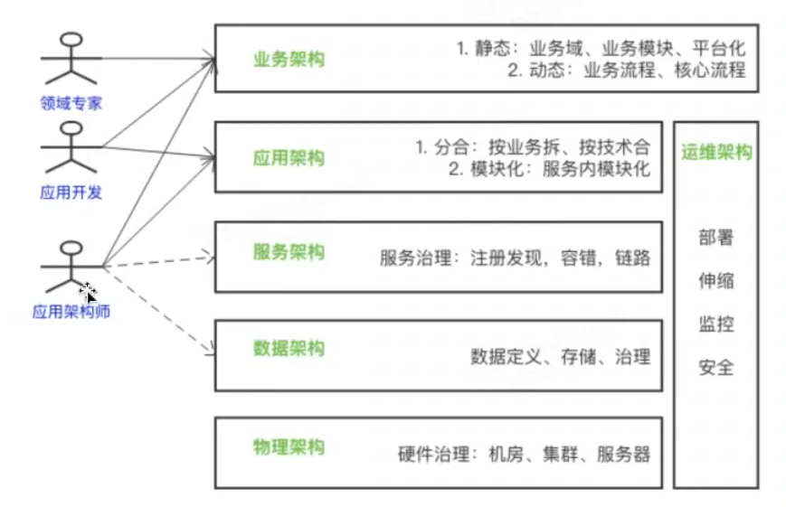

# DDD的学习

## 软件开发的本质

​	选取合适的技术、花费一定的资源、在可复制的流程里满足特定的市场需求，得到相应的利润。需要兼顾三方的需求：

* 市场：需求、业务逻辑和体验、利润来源。
* 工程：资源规划、流程规范、追求效率。
* 技术：非业务需求、更新换代和解决问题（引入问题）、架构设计

## DDD概述

​	Domain Driven Design ( DDD)是一种应对软件复杂的设计方法论，提倡聚焦业务领域而非技术，合理规划业务和技术的依赖，从而达到一种稳定的领域模型，从而应对多变的业务需求。

## DDD的思量

DDD要求从软件开发的市场、技术、工程三个方面通盘考虑。

* 需求元素
  * 基于需求提炼领域知识、领域建模、聚焦业务

* 架构元素
  * 用整洁分层的技术架构指导开发、解耦业务和技术
* 工程元素
  * 强调面向对象设计规范，坚持四重边界

### 需求元素---业务复杂性

​	下图概括了复杂软件的扩展方向：

* X轴：服务/数据水平复制（当请求量变大的时候，可以通过集群、或者负载均衡去扩展）
* Y轴：职责/功能划分（对不同的业务进行不同的拆分，例如分库分表，经常用的数据拆分到处理性能高的地方）
* Z轴：服务/数据优先级划分（没有通用解决方案，DDD算是这里的一个解决方法）

### 架构元素

#### 软件架构的演变

​	拆分--->内聚--->结构化依赖解耦--->扩展

业务拆分：

* 业务拆分：SAAS（MVC、SSM分层）--->DDD分层
* 技术复用：PAAS（SOA、微服务、云原生、mesh、异地多活）
* 屏蔽OS：IAAS(VM、Docker、K8S)

介绍一下SAAS/PAAS/IAAS

* IASS就是提供硬件支持的，提供烤披萨的炉子，餐具，灶具。（代表：阿里云）

* PAAS就是提供平台服务,提供烤披萨的炉子，餐具，饼皮。（代表：百度云、新浪云）
* SAAS就是直接提供服务，提供平台服务,你去店里直接买披萨（代表：QQ、PayPal）

#### DDD的架构范畴

* 业务架构
  * 静态：业务域、业务模块、平台化
  * 动态：业务流程、核心流程

* 应用架构
  * 分合：按业务拆、按技术合
  * 模块化：服务内模块化

* 服务架构
  * 服务治理：注册发现，容错，链路

* 数据架构：数据定义、存储、治理
* 物理架构：硬件治理（机房、集群、服务器）
* 运维架构：部署、伸缩、监控、安全

特别注意：关注业务架构，因为需要对业务进行抽象！

#### DDD架构的演变

**分层架构**

​	最早出现的DDD相关的架构，由Eric Evans 2003年提出，也是大家俗称的分层架构。这种架构的特点是提出把代码按照DDD的概念做了分层归属，特别是应用服务层和领域层是DDD特有的概念。这里拿MVC举例：

* User Interface Layer：相当于以前的M层，写controller和前端进行交互
* Application Layer：相当于Service层，DDD里着重把Service层进行了拆分。
* Domain Layer：相当于Service层，DDD里着重把Service层进行了拆分。
* Infrastructure Layer：相当于dao层，运用于和db打交道。

​	原因：业务越来越复杂，进行服务拆分的时候越来越麻烦，从而进行了引进。

缺点：领域层和Infrastructure Layer还是存在依赖关系。

**六边形架构**

​	2005年Alistair Cockburn提出的接口&适配器架构，Alistair Cockburn一开始提出的端口适配器架构，并没有融入太多DDD特色的应用服务层和领域层。它只是笼统的分为内层的业务逻辑层和外层的输入输出相关的适配层。其中适配层又可细分为主动适配层和被动适配层。

* 内层六边形：应用程序、领域模型
* 外层六边形：主要由适配器组成，接口编程，就是controller层

优点：因为环境已经和db还有外层测试环境进行了隔离，所以测试起业务可以直接测试，非常方便。 

**洋葱架构**

​	洋葱架构的特点是围绕独立的领域模型构建应用，内层定义接口，外层实现接口，依赖的方向指向圆心

**整洁架构**

​	整洁架构跟洋葱架构基本一样，只是层次上的叫法没有完全遵循DDD概念。（越内层，越关注业务）

**CQRS（读写分离架构）**

​	CQRS一般结合event sourcing一起使用，是一种读写分离架构，命令类型负责产生和修改数据，查询类型负责读取数据。

缺点：实时性和一致性存在问题，因为写入的时候，可能读取存在延迟。

**核心域、通用域和支撑域**

>领域会细分为不同的子域，子域可以根据自身重要性和功能属性划分为三类子域，它们分别是：核心域、通用域和支撑域。
>
>决定产品和公司核心竞争力的子域是核心域，它是业务成功的主要因素和公司的核心竞争力。
>
>没有太多个性化的诉求，同时被多个子域使用的通用功能子域是通用域。
>
>还有一种功能子域是必需的，但既不包含决定产品和公司核心竞争力的功能，也不包含通用功能的子域，它就是支撑域。
>
>    这三类子域相较之下，核心域是最重要的，通用域和支撑域如果对应到企业系统，举例来说的话，通用域则是你需要用到的通用系统，比如认证、权限等等，这类应用很容易买到，没有企业特点限制，不需要做太多的定制化。而支撑域则具有企业特性，但不具有通用性，例如数据代码类的数据字典等系统。
>
>    还是拿上图的桃树来说。我们将桃树细分为了根、茎、叶、花、果实和种子等六个子域，那桃树是否有核心域？有的话，到底哪个是核心域呢？
>
>不同的人对桃树的理解是不同的。如果这棵桃树生长在公园里，在园丁的眼里，他喜欢的是“人面桃花相映红”的阳春三月，这时花就是桃树的核心域。但如果这棵桃树生长在果园里，对果农来说，他则是希望在丰收的季节收获硕果累累的桃子，这时果实就是桃树的核心域。在不同的场景下，不同的人对桃树核心域的理解是不同的，因此对桃树的处理方式也会不一样。园丁更关注桃树花期的营养，而果农则更关注桃树落果期的营养，有时为了保证果实的营养供给，还会裁剪掉疯长的茎和叶（通用域或支撑域）。
>
>同样的道理，公司在 IT 系统建设过程中，由于预算和资源有限，对不同类型的子域应有不同的关注度和资源投入策略，好钢要用在刀刃上。
>
>
>
>**领域拆分为子领域就是做减法的过程，降低了业务的理解复杂度和系统实现的复杂度，而核心域，通用域，支撑域的划分是跟公司的商业模式有关系的，决定了子领域的不同优先级和资源投入策略。**

## 专有名词解释

​	根据重要性，DDD有很多层其中就包括领域层（Domain），领域层（Domain）可以将子域分为 核心域、支撑域和通用域，一般来说，我们要将重点放到核心域的开发与集成上。

### 事件风暴与模型确立

​	事件风暴是建立领域模型的主要方法，它是一个从发散到收敛的过程。它通常采用用例分析、场景分析和用户旅程分析，尽可能全面不遗漏地分解业务领域，并梳理领域对象之间的关系，这是一个发散的过程。事件风暴过程会产生很多的实体、命令、事件等领域对象，我们将这些领域对象从不同的维度进行聚类，形成如聚合、限界上下文等边界，建立领域模型，这就是一个收敛的过程。

### 实体和值对象

​	值对象和实体是相对于场景而言的，要根据具体场景具体分析。下面举一些我的粗略见解，如有不对，请批评。

​	例如，在汽车租借系统中，汽车就是一个实体，而发动机就是一个值对象，因为相对于这个系统而言，发动机具体是什么样的并没有意义。我们关注的是车，什么样的车，租什么样的价格。

​	但是，如果是在汽车配件系统中，发动机就是一个实体，值对象变成了发动机内部的配件，因为发动机内部的配件对我而言没什么意义。我不会造发动机，那发动机就是直接买过来的。当然，我要是发动机制造系统，就又是另一个说法了。

### 聚合

在DDD中，实体和值对象都是很基础的领域对象。

聚合是什么呢？类比一下：

| DDD的概念                                                    | 人类                                                         |
| ------------------------------------------------------------ | ------------------------------------------------------------ |
| 实体，值对象                                                 | 人                                                           |
| 聚合                                                         | 社团，组织，部门                                             |
| 聚合的好处：                                                 |                                                              |
| 让实体和值对象协同工作的组织就是聚合，用来确保这些领域对象在实现公共的业务逻辑的时候，可以保持数据的一致性 | 个人是组织的一员，协同工作，有共同目标，可以发挥出更大的力量 |

聚合的另一种视图： 聚合是业务和逻辑紧密关联的实体和值对象组合而成，聚合是数据修改和持久化的基本单元，一个聚合对应一个数据的持久化；

聚合在DDD分层架构中属于领域层，领域层包含了多个聚合，共同实现核心业务逻辑，聚合内的实体以充血模型实现个体业务能力，以及业务逻辑的高内聚；
跨多个实体的业务逻辑通过领域服务来实现，跨多个聚合的业务逻辑通过应用服务来实现；

| 跨越场景                                     | 处理办法                   |
| -------------------------------------------- | -------------------------- |
| 业务场景需要一个聚合中的A实体和B实体共同完成 | 业务逻辑用领域服务来实现； |
| 业务逻辑需要聚合C和聚合D共同完成             | 应用服务来组合这两个服务； |

### 领域模型

​	**领域模型是对领域内的概念类或现实世界中对象的可视化表示。**又称概念模型、领域对象模型、分析对象模型。它专注于分析问题领域本身，发掘重要的业务领域概念，并建立业务领域概念之间的关系。

​	**没有所谓唯一正确的领域模型。所有模型都是我们对试图要理解的领域的近似表示。**领域模型主要是在特定群体中用于理解和沟通的工具。有效的领域模型捕获了当前需求语境下的本质抽象和理解领域所需要的信息，并且可以帮助人们理解领域的概念、术语和关系。

### 统一语言

​	统一语言是提炼领域知识的产出物，获得统一语言就是需求分析的过程，也是团队中各个角色就系统目标、范围与具体功能达成一致的过程。

#### 为什么使用“统一语言”

开发人员与领域专家之间，他们掌握的知识存在巨大的差异。善于技术的开发人员关注于数据库、通信机制、集成方式与架构体系，而精通业务的领域专家对这些却一窍不通，但他们在讲解业务知识时，使用各种概念如呼吸一般自然，这些对于开发人员来说，却成了天书，这种交流就好似使用两种不同语言的外国人在交谈。在没有达成一致的情况下，那就是鸡同鸭讲，毫无沟通效率，相反还可能造成误解。从需求中提炼出统一语言，其实就是在两个不同的语言世界中进行正确翻译的过程。

#### "统一语言”用处

一旦确定了统一语言，无论是与领域专家的讨论，还是最终的实现代码，都可以通过使用相同的术语，清晰准确地定义领域知识。重要的是，当我们建立了符合整个团队皆认同的一套统一语言后，就可以在此基础上寻找正确的领域概念，为建立领域模型提供重要参考。 

**统一语言体现在两个方面：**统一的领域术语、领域行为描述

>- 统一的领域术语
>
>领域术语通常表示对象命名，如商品、订单等，对应实体对象
>
>- 领域行为描述
>
>领域行为通常表示一个动作或事件，如商品已下单、订单已付款等，对应领域事件或者命令

##### 统一的领域术语

领域术语是有行业规范的，例如财会领域就有标准的会计准则，对于账目、对账、成本、利润等概念都有标准的定义，在一定程度上避免了分歧。然而，标准并非绝对的，在某些行业甚至存在多种标准共存的现象。

- 民航业的运输统计指标为例，牵涉到与运量、运力以及周转量相关的术语，就存在 ICAO（International Civil Aviation Organization，国际民用航空组织）与IATA（International Air Transport Association，国际航空运输协会）两大体系，而中国民航局又有自己的中文解释，航空公司和各大机场亦有自己衍生的定义

- 如果我们不明白城市对运量与航段运量的真正含义，就可能混淆这两种指标的统计计算规则。这种术语理解错误带来的缺陷往往难以发现，除非业务分析人员、开发人员与测试人员能就此知识达成一致的正确理解。

 **我们可以做什么**

* 在领域建模过程中，我们往往需要在文档中建立一个大家一致认可的术语表。
* 语表中需要包括整个团队精炼出来的术语概念，以及对该术语的清晰明白的解释。
* 为难以理解的术语提供具体的案例。
* 一旦发生变更，也需要及时地对其进行更新。
* 在维护领域术语表时，一定需要给出对应的英文术语，否则可能直接影响到代码实现。

##### 领域行为描述

领域行为描述可以视为领域术语甄别的一种延伸。领域行为是对业务过程的描述，相对于领域术语而言，它体现了更加完整的业务需求以及复杂的业务规则。在描述领域行为时，需要满足以下要求：

- 从领域的角度而非实现角度描述领域行为
- 若涉及到领域术语，必须遵循术语表的规范
- 强调动词的精确性，符合业务动作在该领域的合理性
- 要突出与领域行为有关的领域概念

总结：磨刀不误砍柴工，多花一些时间去打磨统一语言，并非时间的浪费，相反还能改进领域模型乃至编码实现的质量，反过来，领域模型与实现的代码又能避免统一语言的“腐化”，保持语言的常新。重视统一语言，就能促成彼此正面影响的良性循环；否则领域模型与代码会因为沟通不明而泥足深陷，就真是得不偿失了。(说白了就是：我们制定了术语，所有人都得听得懂)

 ### 界限上下文

#### 什么是界限上下文

​	对应于通用语言，限界上下文是语言的边界，对于领域模型，限界上下文是模型的边界，二者对应于问题空间（Problem Space）的界定。 对于系统的架构，限界上下文还确定了应用边界和技术边界，进而帮助我们确定整个系统及各个限界上下文的解决方案。 可以说，限界上下文是连接问题空间与解决方案空间的重要桥梁。

​	这个时候又引申除了两个词，也就是问题和解决方案空间，我们来看一下。

#### 问题空间和解决方案空间

​	领域中同时存在问题空间和解决方案，问题空间中，我们考虑的是业务所面临的挑战，在解决方案空间中，我们思考的是如何通过技术来解决这些业务挑战

* 问题空间(Problem Space）

  是领域的一部分，对于问题空间的开发将产生一个新的核心域，对于问题空间的评估应该同时要考虑已有的子域和额外所需的子域，因此**问题空间是核心域和其他子域的组合**。

* 解决方案空间(Solution Space）

  包括了一个或者多个限界上下文，即一组特定的软件模型，这是因为限界上下文就是一个特定的解决方案，因为它能够通过技术的方式来实现解决方案。

根据以上的解释，我们可以认为：

>1. 限界上下文规定了界限。
>
>   这个界限包括语言含义的界限和模型的界限。应用的界限和技术的界限。
>
>2. 限界上下文解决了问题
>
>   我们通过一个或多个限界上下文，里面包括了聚合、实体、值对象、领域事件、领域服务等，能够解决实际的业务需求

#### 界限上下文实操

首先先来一张图，让大家对限界上下文有一个直观的感受。

* 限界上下文用实线分隔开
* 子域用虚线分隔开
* 不同的限界上下文用实线进行关联（上下文映射）

##### 简单分析

​	 首先这个是一个抽象的业务领域，这个里边包含着子域和限界上下文，abstract的好处就在于，我们可以将已知的或者我们正在涉及到的领域知识进行嵌套。

##### 个人理解

 	其实困难的地方就在于如何合理的区分子域、核心域、支撑域、通用域，每个公司的业务场景不一样，分出来的领域模型也会不一样，难点就在于，我给出任何例子，都仅能代表某一时刻的某一公司的业务场景，完全不具备通用性，所以例子的作用也是帮助大家去理解思想，并不是真正的要深入业务，不要舍本逐末。

#### 例子

​	业务场景：公司 J是做线下生鲜超市的，对于线下超时来说，所有的sku（代表单个单品参数，包含颜色、款式等信息）的实时成本价格是非常重要的，线下的业务场景比较多，所以我们需要对接wms（仓储管理系统）作为我们的网关系统，当库存发生变动时，来计算实时的sku成本价，也就是仓报价。

下面我将仓报价系统拆为以下几个子域和限界上下文。

- 核心域：价格计算限界上下文
- 支撑域：库存变更消息转换限界上下文、SPI限界上下文（可以是Dubbo的spi或者是java的，生成对象使用）、wms（仓储管理系统）限界上下文
- 通用域：数据校验限界上下文

注：我无法将所有的限界上下文全部列出，只列出了类似于敏捷开发中的MVP。只是为了说明本节讨论的问题。

一般来说，一个子域对应着一个限界上下文是比较合适的，但是，有些场景下并一定非要这样不可。

* 首先，对于核心域来说，一定是我们系统最重要的功能，我们系统就是为了计算成本价格，所以计算价格的限界上下文一定是属于核心域。
* 我们系统承接wms的mq消息，对于我们系统来说，接谁的消息不重要，重要的是把消息转换为我们仓报价系统能够识别的语言。所以接收消息进行语言转换，对我们来说是支撑域。同时，对于SPI（可以是Dubbo的spi或者是java的，生成对象使用）来说，我们需要RPC或者其他方式来建立与其他系统的数据沟通渠道，获取一些我们认为重要的值，比如说，我们需要调用采购系统的服务，来提供给我们采购价，需要调用加工系统，来给我们返回加工的比例等等。所以对我们来说也是支撑域
* 对于数据的准确性校验，一致性校验，传ebs数据（管理套件，扩展版的ERP）的校验，这些都需要一定的规则来处理，为的是及时的预警出来，我们需要自己系统实现validate或者使用共用的validate组件，这不重要，重要的是对于我们系统来说，validate是一个与其他限界上下文都有紧密关系的限界上下文，但此处并不属于共享内核。只是一个通用域

**总结**

​	总之，业务场景不同，拆分的粒度不同，限界上下文是一个显式的边界，领域模型、领域服务、领域事件等就存在于边界之内，在边界内，通用语言中的所有术语都有特定含义，可以说，不同限界上下文中可能有同样的词汇，但是对于一个限界上下文内，不存在二义性。希望能够帮助大家理解好限界上下文

