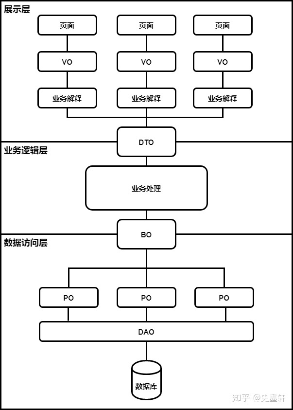

# DDD的学习

​	因为先前刚接触DDD，所以总是这学一点，那学一点，导致整个笔记很乱，这里重新开个笔记，把学习脉络梳理一下。这里先简单阐述下DDD，再来分步介绍。

**DDD=战略设计+战术设计**

* **战略设计主要从业务视角出发** ，建立业务领域模型，划分领域边界，建立通用语言的限界上下文，限界上下文可以作为微服务设计的参考边界。
* **战术设计则从技术视角出发** ，侧重于领域模型的技术实现，完成软件开发和落地，包括：聚合根、实体、值对象、领域服务、应用服务和资源库等代码逻辑的设计和实现。

## 实体和值对象：从领域模型的基础单元看系统设计

### 实体结构图

​	先复习一下实体这个词，从刚开始的entity（或者叫pojo）到目前分出了VO、DTO、BO、DO、PO等一系列专有名词。

这里按照：展示层（前端展示页面）、service层、Dao层（数据库交互）来进行区分：

* VO：和前端进行交互的实体，提供给前端展示使用。（展示层）

（例如：DTO性别是，1和0代表男和女。但是前端需要的是帅哥和美女，那就需要VO充当这个DTO的转换）

* DTO：处于service层，和DO存在着一对多，或者多对多的关系，为了集合数据库数据。

（例如：DO层查出来的user带用户信息和密码，但是我这个密码肯定不能给用户看，那我就需要一个DTO层，过来过滤掉这个。

DTO层可以包含很多个DO，或者DO的部分信息）

特别注意：DTO需要“扁平化”，例如user这个类，它可能包含了证件信息，证件信息又是一个类。此时DTO再去引用user这个类，就会存在对象树。

* BO：BO就是DO的集合，当然这个集合不同于DTO，这个集合只负责搜集DO，并不会去除不需要的元素。

（例如：PO1是交易记录，PO2是登录记录，PO3是商品浏览记录，PO4是添加购物车记录，PO5是搜索记录，BO是个人网站行为对象）

* DO和PO：大部分情况是一致的，现在的业务应用开发，基本上**不需要区分**DO与PO，PO完全可以通过JPA，Hibernate Annotations/hbm隐藏在DO之中。

